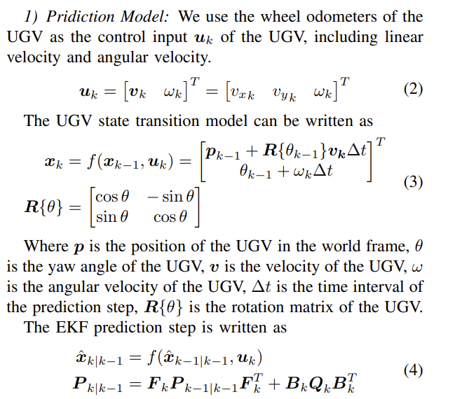
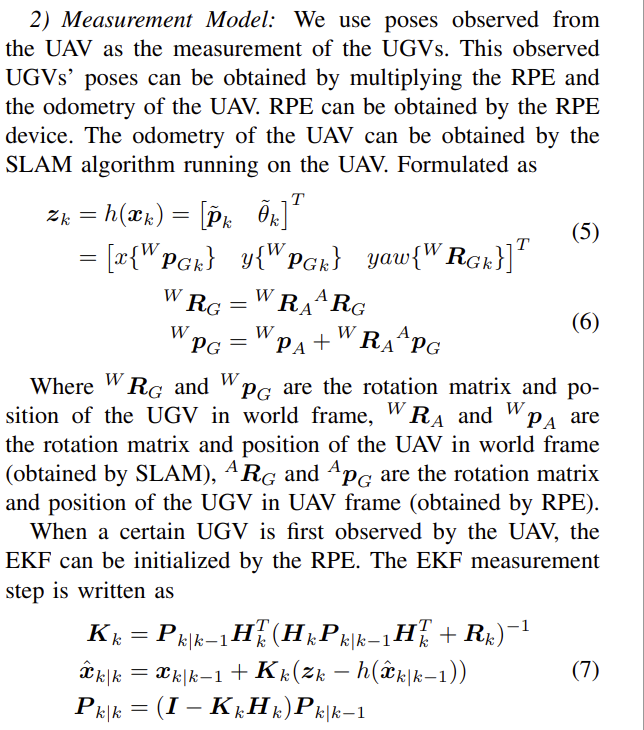

# ColAG: A Collaborative Air-Ground Framework for Perception-Limited UGVs’ Navigation

## **一、引言**

如今，无人地面车辆（UGVs）和无人机（UAVs）在许多领域中广泛使用，例如监视、农业、搜索和救援以及运输，这些领域几乎都依赖于各种外部传感器来感知环境，例如激光雷达、摄像机和雷达等。感知能力是自主导航在未知、障碍密集区域的关键功能，也是后续导航模块如制图、规划和高级策略的前提条件。对于感知能力有限的机器人来说，安全导航尤为具有挑战性，尤其是当它们缺乏检测环境的传感器时，本文讨论的就是这种情况下的“盲导”机器人。此外，当涉及到多机器人组时，由于缺少感知能力，潜在的机器人间碰撞问题会变得更加复杂。随着组内机器人数量的增加，为所有机器人配备昂贵的感知或SLAM系统可能成本很高。

本文针对一组低成本盲导UGVs的自主导航问题提出了解决方案。我们的动机来源于UGVs具有的独特优势，如低成本、高载重能力和低能耗。UGVs通常用作任务执行单元，并因其这些优势而作为一个群体运作，例如多机器人协作运输。除了昂贵的传感器装备之外，地面视角也不能最大化这些昂贵传感器的效用。相比之下，UAVs在三维空间中具有卓越的机动性，因此具有更大的感知区域。结合这些优势，形成一个包括UGVs和UAVs的协作系统，可以以低成本高效完成需求任务。因此，我们引入了一架装备了完整感知能力的空中机器人，作为共享的移动远程眼睛，协作引导一群盲导UGVs从空中视角解决盲导导航问题。

继续这一概念，本系统的主要问题是如何使用具有感知能力的UAV安全且有效地指导感知受限的UGVs在未知环境中导航。对于一架单独的UAV来说，同时引导多个地面机器人并非易事。主要挑战来自三个方面：相对位置估计（RPE）的限制、UGVs在接收到的地图中的规划以及UAV对动态变化情况的调度。在本系统中，UAV和UGVs之间的连接是通过相对状态估计系统建立的，例如使用AprilTag、专门设计的LED板或CREPES等。注意，我们不考虑来自全局定位系统（例如运动捕捉系统）的RPE技术，因为这依赖于基础设施。然而，所有这些RPE技术都是直接观测，因此受到视野（FOV）和环境遮挡的限制。一架UAV无法保证所有UGVs都在其FOV中不断被稳定地观测到以保持稳定的RPE。UGVs面临的挑战是在没有直接环境感知的情况下在共享地图中导航。使UGVs在包括自由区域、障碍区域和未知区域的接收地图中实现最佳规划至关重要。未知区域的处理不仅影响碰撞预测，还极大地影响规划质量。仅用车轮里程表控制盲导UGVs面临着巨大的挑战，如果不采取进一步措施，仅进行轨迹跟踪则不够。

为了克服这些困难并解决盲导导航问题，我们提出了一个新颖的协作空地框架（ColAG），它利用一架感知能力的UAV指导多个盲导UGVs同时进行。UAV配备了激光雷达和RPE设备，而UGVs只装备RPE设备和车轮里程表。UAV使用SLAM获得其里程计和地图，并与UGVs共享，以恢复全球一致的地图。UGVs接收共享的地图并规划轨迹，同时使用EKF来估计它们在地图中的里程计。EKF将来自UAV的RPE测量和其车轮里程表融合。盲导UGVs不断预测由里程计估计的不确定性和地图中未知区域引起的可能碰撞。然后将可能的碰撞信息发送给UAV，UAV计划其运动以提供UGVs更新的测量数据以保存它们免于碰撞。
这篇论文的贡献总结如下：

1) 我们提出了ColAG，这是一个新颖的框架，用于解决盲导UGVs在未知拥挤环境中自主导航的问题，由一架UAV指导一组盲导UGVs。

2) 我们为盲导UGVs设计了一种路径规划策略，该策略积极规划轨迹，并保守预测UGVs由于定位不确定性造成的可能碰撞，以提高效率并确保UGVs的安全。

3) 我们将UAV的调度问题公式化为动态车辆路径问题，具有时间窗口（VRPTW），以最小化UAV的轨迹长度并在UGVs达到预测碰撞位置前最大化支持。

4) 我们发布了ColAG的实现，供社区参考和使用。

本论文通过广泛的模拟，包括多达7辆UGVs的模拟，以及3辆UGVs的实际实验验证了我们系统的有效性。

在引言部分，我们介绍了UGVs和UAVs的广泛应用，特别是在需要感知环境的任务中，如监控和搜索救援。UGVs的感知受限是本文研究的重点，由于成本问题，不可能为所有UGVs配备高级感知设备，而UAVs由于其独特的空中优势，可以作为视觉支持，辅助UGVs完成任务。本研究的目的是探讨如何通过UAV和UGVs的合作，克服单一系统的限制，实现成本效益和效率的最优化。

## **二、相关工作**

大量研究已经关注异构机器人系统，特别是在协作空中-地面机器人系统方面。这些研究主要集中在结合两种类型的机器人共同完成任务，如探索和重建，利用每种机器人的互补优势。这些研究旨在解决不同类型机器人在性能和能力上固有的局限性。

一些研究涉及使用UAVs帮助UGVs移动，利用UAV更广泛的视野来增强UGVs的环境信息。Delmerico等人和Peterson等人将图像合成为正射影像图，然后使用经典计算机视觉方法对其进行分类，以生成UGV的初始轨迹。Miller等人利用空中和地面之间的语义信息，实现RPE，并实时与多UGV协作。这种合作使UGVs能够从UAV的空中视角中受益，并获得更全面的情境感知。

在一些研究中，去除了UGVs携带的环境感知传感器，使用UAV与UGVs之间的RPE来获取UGVs的定位。Cognetti等人使用一架装有摄像头的UAV为多个UGVs提供定位，并开发了一种合作控制方案，以保持UGVs在摄像机视野内。Guerin等人使用UAV上的视觉伺服来保持领导UGV在图像平面的中心以进行UGV的定位，导航航点由人工操作员给出。Mueggler等人使用AprilTag，它可以被UAV的摄像机检测到，来定位UGV，以补偿UGV轮式里程计的漂移。这些方法不仅效率低下，还限制了UAV的移动性，也没有观察，UGV的定位面临漂移和不确定性。

系统中的定位不确定性带来了碰撞风险，这在规划和控制中得到了研究。EKF是最常用的不确定性传播方法。Zhu等人、Kamel等人和Patil等人使用EKF沿计划轨迹传播不确定性。不同的方法用于检查不确定性下的碰撞。Zhu等人计算碰撞机会的近似紧凑边界，Kamel等人使用不确定矩阵的最大特征值作为σ，然后使用3σ作为碰撞距离，Patil等人截断先验分布以获得碰撞概率。

对UAVs的有效调度是指导这些盲导UGV系统所必需的，这已在自主探索问题中进行了研究。Zhou等人和Meng等人通过将其公式化为旅行推销员问题（TSP）的小修订版，为UAV找到有效访问视点的全球旅行。Zhou等人和Gao等人利用约束车辆路径问题（CVRP）来最小化UAVs路径的总长度，并平衡UAVs的工作量。Stump等人考虑了持久监视问题，并将其构造为VRPTW，以找到周期性访问离散站点的序列。

在ColAG中，我们为UGV设计了一种严格安全的路径规划策略，包括轨迹生成和基于不确定性传播的碰撞预测，对于UAV，我们设计了一种调度方法，将其公式化为VRPTW，以指导UAV支持UGVs。
## **三、ColAG框架**

如图3所示，ColAG中的关系类似于助手与接受者之间的关系。感知型无人机（UAV）运行SLAM以生成其地图和里程计，支持UGVs的协作姿态估计（III-A），与UGVs分享地图（III-B）。盲导UGVs在接收到的地图中规划轨迹并预测可能的碰撞（III-C），然后将碰撞信息发送给UAV以请求支持。UAV利用这些信息动态更新VRPTW以安排其航点，以优化UGVs的支持顺序（III-D）。

### **A. 协作姿态估计**
UAV通过激光雷达SLAM直接获取其里程计和地图，而盲导UGVs则必须将其车轮里程计和UAV的RPE融合，以获得全球一致的姿态估计。UGVs使用EKF融合RPE、UAV的里程计和车轮里程计。我们将UGV在时间k的状态写作xk，包括2D位置和航向。


$$
\mathbf{x}_k = \begin{bmatrix}
p_k \\
\theta_k
\end{bmatrix}^T
= \begin{bmatrix}
p_{xk} \\
p_{yk} \\
\theta_k
\end{bmatrix}^T  \quad(1)
$$


#### **1 预测模型**：
我们使用UGV的车轮里程计作为UGV控制输入uk，包括线性速度和角速度。

$$
\mathbf{u}_k = \begin{bmatrix}
v_k \\
\omega_k
\end{bmatrix}^T
= \begin{bmatrix}
v_{xk} & v_{yk} & \omega_k
\end{bmatrix}^T  \quad(2)
$$


UGV状态转换模型可以写为：


$$
\mathbf{x}_k = f(\mathbf{x}_{k-1}, \mathbf{u}_k) = \begin{bmatrix}
p_{k-1} + R(\theta_{k-1}) \mathbf{v}_k \Delta t \\
\theta_{k-1} + \omega_k \Delta t
\end{bmatrix}^T             \quad(3)
$$

其中，

$$
R(\theta) = \begin{bmatrix}
\cos \theta & -\sin \theta \\
\sin \theta & \cos \theta
\end{bmatrix}
$$


其中p是UGV在世界坐标系中的位置，θ是UGV的偏航角，v是UGV的速度，ω是UGV的角速度，∆t是预测步骤的时间间隔，R{θ}是UGV的旋转矩阵。


EKF 预测步骤写为：

$$
\hat{\mathbf{x}}_{k|k-1} = f(\hat{\mathbf{x}}_{k-1|k-1}, \mathbf{u}_k)
$$

$$

\mathbf{P}_{k|k-1} = \mathbf{F}_k \mathbf{P}_{k-1|k-1} \mathbf{F}_k^T + \mathbf{B}_k \mathbf{Q}_k \mathbf{B}_k^T            \quad \quad(4)
$$


####  **2) 测量模型：**
我们使用从无人机（UAV）观测到的无人地面车辆（UGVs）的姿态作为测量值。这些观测到的UGVs的姿态可以通过将相对姿态误差（RPE）和UAV的里程计相乘得到。RPE可以通过RPE设备获取。UAV的里程计可以通过在UAV上运行的同时定位与地图构建（SLAM）算法获得。公式化为：

$$
zk = h(xk) = [ \tilde{p}_k  \tilde{\theta}_k ]^T
    = [ x^W_{PG_k}   y^W_{PG_k}   yaw^W_{RG_k} ]^T                  \quad(5)
$$

$$
W_{RG} = W_{RA} A_{RG} \\
W_{PG} = W_{PA} + W_{RA} A_{PG}                                           \quad(6)
$$

其中 $( W_{RG} )$ 和 $( W_{PG} )$ 是UGV在世界坐标系中的旋转矩阵和位置，$( W_{RA} )$ 和 $( W_{PA} )$ 是UAV在世界坐标系中的旋转矩阵和位置（通过SLAM获得），$( A_{RG} )$ 和 $( A_{PG} )$ 是UGV在UAV坐标系中的旋转矩阵和位置（通过RPE获得）。

当UAV首次观测到某个UGV时，可以通过RPE初始化扩展卡尔曼滤波器（EKF）。EKF测量步骤写为：


$$
\mathbf{K}_k = \mathbf{P}_{k|k-1} \mathbf{H}_k^T (\mathbf{H}_k \mathbf{P}_{k|k-1} \mathbf{H}_k^T + \mathbf{R}_k)^{-1}
$$

$$
\hat{\mathbf{x}}_{k|k} = \hat{\mathbf{x}}_{k|k-1} + \mathbf{K}_k (\mathbf{z}_k - h(\hat{\mathbf{x}}_{k|k-1}))
$$

$$
\mathbf{P}_{k|k} = (\mathbf{I} - \mathbf{K}_k \mathbf{H}_k) \mathbf{P}_{k|k-1}\quad(7)
$$


### **B. 地图共享**

我们使用占据网格地图作为地图格式。在UAV中，网格地图是一个三维数组，每个单元代表环境中的一个网格，单元的值代表网格的状态。网格的状态可以是自由、占用或未知，这取决于单元的值。注意，这三种状态在UGVs的导航中被不同处理，详见Sec. III-C。为了减少地图共享所需的带宽，UAV仅发送UGVs周围特定区域中占用单元和未知单元的地址，而空闲单元可以作为该区域中的剩余单元推断出来。当UGVs接收到地图信息时，它们以与UAV相同的格式存储，并根据占用单元和未知单元的地址合并地图。
### **C. UGV的路径规划**

由于UAV和UGVs的不同视角，UGVs周围的环境可能在UAV的地图中被遮挡，表现为UGVs地图中的未知单元。这些未知单元在现实中可能是自由的或者被占用的，为UGVs与障碍物之间的碰撞带来风险，如图4所示。

图4: UAV构建的地图不适合UGVs规划，因为环境的遮挡。如果UGVs假设未知单元是自由的，规划轨迹上可能存在碰撞的风险。

1) 在P-Map中的轨迹生成：当规划时，建议UGVs只在已知的自由环境中移动可能降低系统的效率。我们采用一种积极策略，即UGVs在规划地图（P-Map）中规划，该地图假设未知单元是自由的，如图5(a)所示。这种方法与自主导航中使用的常规轨迹生成技术一致。

2) 碰撞的潜在风险：这种积极策略为UGVs带来了碰撞风险，我们考虑两种情况：首先，当UAV的RPE观测比预期延迟时，UGVs的里程计会发生偏移，增加了姿态不确定性。其次，未知单元中可能存在UGVs无法感知的障碍物。

3) UGVs的不确定性传播：我们使用EKF的协方差矩阵来表示UGVs姿态估计的不确定性。我们通过方程(4)计算沿规划轨迹的预测步骤，在一定距离内传播UGV的不确定性。

4) CP-Map中基于不确定性的碰撞检测：为了统一处理III-C.2中的两种情况，我们提出了一种基于不确定性的碰撞预测方法，在碰撞预测地图（CP-Map）中，该地图将未知单元视为被占用，如图5(b)所示。

图5: UGVs的路径规划。(a) UGV在P-Map中规划，红线是规划的路径。(b) UGV在CP-Map中传播不确定性并沿轨迹预测碰撞，绿色区域是预测的协方差椭圆，红色椭圆是碰撞椭圆，蓝点是碰撞点。

由于EKF的协方差矩阵是一个近似高斯分布，我们可以使用它来找出UGVs在CP-Map中可能的碰撞。根据二维高斯分布的3σ规则，即随机变量在其均值的3σ范围内的概率为98.89%，我们可以假设如果UGVs保持在其姿态估计沿轨迹的3σ内，则是安全的。计算如下：

首先，我们计算扩展卡尔曼滤波器（EKF）的协方差矩阵的特征值和特征向量
$$
Q^{-1} P_{xy} Q = \Lambda = diag(\lambda_1, \lambda_2) \quad (8)
$$
$$
Q = [v1 \quad v2]
$$
其中，$(P_{xy})$ 是EKF在XY平面的协方差矩阵，$(\Lambda)$ 是 $(P_{xy})$ 的特征值，$(v1)$ 和 $(v2)$ 是 $(P_{xy})$ 的特征向量。

然后我们计算3σ椭圆
$$
a = 3\sqrt{\lambda_1}, \quad b = 3\sqrt{\lambda_2} \quad (9)
$$
$$
1 \geq \left( \frac{(p - p_G) v1}{a} \right)^2 + \left( \frac{(p - p_G) v2}{b} \right)^2
$$
其中 $(a)$ 和 $(b)$ 是椭圆的半长轴和半短轴的长度，$(p)$ 是椭圆中单元格的位置，$(p_G)$ 是UGV的位置。

最后，我们遍历椭圆占据的单元格，并在规划轨迹上找到UGVs的碰撞椭圆 $(p_{pc})$ 和碰撞时间 $(t_{pc})$。由于激光雷达有一些盲点，我们选择一个预期的支撑点 $(p_{ps})$，该点距离 $(p_{pc})$ 有一定的距离，并朝着计划速度的方向。$(p_{ps})$ 和 $(t_{pc})$ 被组合为碰撞信息。

注意，当UGV与UAV的碰撞时间少于阈值 $(t_c)$（在我们的工作中为0.4秒）时，UGV将停下来等待UAV。
### **D. UAV的调度**

由于我们只有UAV来感知环境，我们需要有效地调度UAV来帮助UGVs最大化其效率。当UAV前来支持时，它可以提供RPE测量和附近的地图信息，以便UGVs可以更新其姿态估计，获取潜在碰撞单元的信息，并重新规划轨迹以避免碰撞。为了最小化由于可能的碰撞而导致的UGVs等待时间，我们需要UAV在UGVs达到潜在碰撞单元之前给予支持，如图6所示。

我们将UAV的调度问题公式化为带时间窗的车辆路线问题（VRPTW），设计时间成本矩阵Mvrptw和时间窗矩阵Vvrptw。假设有N个碰撞点，Mvrptw对应一个N+1维的方阵，而Tvrptw是一个(N+1)×2的矩阵，计算如下：

我们通过设计时间成本矩阵 $( M_{vrptw} )$ 和时间窗矩阵 $( V_{vrptw} )$ 来公式化无人机（UAV）的调度问题，这是带时间窗的车辆路径规划（VRPTW）问题。假设有 $( N )$ 个碰撞点，$( M_{vrptw} )$ 对应一个 $( N+1 )$ 维的正方形矩阵，而 $( T_{vrptw} )$ 是一个 $( (N+1) \times 2 )$ 的矩阵，计算如下：

$$
M_{vrptw}(k_1, k_2) = M_{vrptw}(k_2, k_1) = t_b(p_{ps_{k_1}}, p_{ps_{k_2}}), \quad k_1, k_2 \in \{1, 2, \ldots, N\} \quad \quad(10)
$$

$$
M_{vrptw}(0, k) = t_b(p_A, p_{ps_k}), \quad k \in \{1, 2, \ldots, N\}
$$

$$
M_{vrptw}(k, 0) = 0
$$

$$
T_{vrptw}(k, 0) = 0
$$

$$
T_{vrptw}(k, 1) = t_{pc_k}, \quad k \in \{1, 2, \ldots, N\} \quad (11)
$$

其中 $( p_A )$ 是无人机的位置。$( t_b(p_{ps_{k_1}}, p_{ps_{k_2}}) )$ 是从 $( p_{ps_{k_1}} )$ 到 $( p_{ps_{k_2}} )$ 的时间成本，通过以下方式计算：

$$
t_b(p_{ps_{k_1}}, p_{ps_{k_2}}) = \frac{\|p_{ps_{k_1}} - p_{ps_{k_2}}\|}{v_{max}} \quad (12)
$$

其中，$( v_{max} )$ 是最大速度。

文档中提到的内容涉及到考虑无人机（UAV）速度的连续性并计算时间成本的方法，还提到了如何解决调度问题，并考虑到在某些情况下可能找不到解决方案的情形。这里是这一段内容的中文翻译：

我们考虑无人机（UAV）速度的连续性并计算时间成本，通过以下方式：

$$
P_{dis} = P_A - P_{ps_k}, \quad v_{tan} = \frac{P_{dis}}{\|P_{dis}\|} \cdot v_A
$$

$$
dis_a = \frac{(v_{max}^2 - v_{d}^2)}{(2a_{max})}
$$

$$
t_b(P_A, P_{ps_k}) = 
\begin{cases} 
\sqrt{\frac{v_{tan}^2 + 2a_{max}dis_a - v_{tan}}{a_{max}}}, & dis_a > \|P_{dis}\| \\
\frac{v_{max} - v_{tan}}{a_{max}} + \frac{\|P_{dis}\| - dis_a}{v_{max}}, & dis_a \leq \|P_{dis}\|
\end{cases} \quad (13)
$$

我们使用运筹学工具（OR-Tools）来解决调度问题。带时间窗的车辆路径规划（VRPTW）问题的公式化是为了确保无人机（UAV）可以在无人地面车辆（UGVs）到达可能的碰撞位置之前支持它们。然而，可能没有解决VRPTW问题的解决方案，这意味着无人机不能及时支持所有UGVs。在这种情况下，我们会逐渐增加 $( v_{max} )$ 直到VRPTW问题可以找到一个解决方案。


## **四、实验**

为了验证ColAG的有效性，我们进行了不同配置的仿真和真实世界实验。

### **A. 仿真实验**

在仿真实验中，我们使用MARSIM模拟器来模拟四旋翼无人机和激光雷达，并使用数值模拟来模拟具有差分底盘的UGVs。我们通过计算真实的RPE并添加高斯噪声来模拟RPE。

图7: ColAG仿真。在(a)-(d)中，无人机支持按照VRPTW解决方案预测将会碰撞的UGVs，提供RPE和激光雷达感知的环境。

UGVs的动力学限制被设置为 $( v_{\text{max}} = 0.5 \, \text{m/s} )$ 和 $( a_{\text{max}} = 1.0 \, \text{m/s}^2 )$，而无人机的设置为 $( v_{\text{max}} = 3.0 \, \text{m/s} )$ 和 $( a_{\text{max}} = 1.0 \, \text{m/s}^2 )$。UGV轮式里程计的模拟高斯噪声设置为 $( \sigma(v_x) = 0.0336 \, \text{m/s} )$ 和 $( \sigma(\omega) = 0.0292 \, \text{rad/s} )$，这是在我们的实际平台上测量的，RPE的噪声设置为 $( 0.2 \, \text{m} )$ 和 $( 0.05 \, \text{rad} )$。激光雷达和RPE的传感器范围分别设置为 $( 8 \, \text{m} )$ 和 $( 5 \, \text{m} )$，地图共享范围设置为 $( 2.5 \, \text{m} )$。

我们在稀疏和密集的环境中测试性能，不同数量的UGVs。环境是27 × 27 × 3 m^3空间，随机生成的障碍物，稀疏环境有40个，密集环境有80个。我们通过以下指标评估性能：

- UGV到达时间（秒）：UGV到达目标的平均时间。
- UGV等待时间（秒）：由于预测的碰撞时间过短，UGV等待的平均时间。
- UGV轨迹长度（米）：UGV轨迹的平均长度。
- 无人机轨迹长度（米）：无人机轨迹的平均长度。

为了证明我们的方法的有效性，我们还模拟了装备全感知能力的UGVs，这些UGVs不需要无人机的帮助。

- 自感知UGV到达时间（秒）：装备有激光雷达并独立运行SLAM的UGVs到达目标的平均时间。
- 自感知UGV轨迹长度（米）：装备有激光雷达并独立运行SLAM的UGVs轨迹的平均长度。

表格展示了在CoIAG基准测试中，不同环境（稀疏和密集）和不同数量的无人地面车辆（UGVs）下的各项性能指标。这里是表格内容的翻译：

$$表 I：CoIAG基准测试$$

| 环境 | UGV数量 | UGV到达时间 | UGV等待时间 | UGV轨迹长度 | UAV轨迹长度 | S.P. UGV到达时间 | S.P. UGV轨迹长度 |
| --- | --- | --- | --- | --- | --- | --- | --- |
| 稀疏（Spar.） | 1 | 106.78 | 0.00 | 33.02 | 36.35 | 106.20 | 32.92 |
|  | 3 | 106.13 | 0.11 | 32.96 | 120.94 | 106.59 | 32.98 |
|  | 5 | 116.62 | 3.87 | 33.65 | 214.07 | 107.59 | 33.32 |
|  | 7 | 129.12 | 12.59 | 33.59 | 265.50 | 106.92 | 33.22 |
| 密集（Dense） | 1 | 112.30 | 0.00 | 34.95 | 38.27 | 111.04 | 34.52 |
|  | 3 | 112.38 | 0.07 | 34.73 | 133.08 | 110.69 | 34.53 |
|  | 5 | 119.54 | 4.86 | 34.68 | 216.05 | 110.50 | 34.38 |
|  | 7 | 143.18 | 24.65 | 34.98 | 304.34 | 111.88 | 34.94 |

- “UGV到达时间”是UGVs到达目标位置所需的平均时间。
- “UGV等待时间”是UGVs在过程中等待的平均时间。
- “UGV轨迹长度”是UGVs行驶的平均总距离。
- “UAV轨迹长度”是无人机（UAV）行驶的总距离。
- “S.P. UGV到达时间”和“S.P. UGV轨迹长度”分别代表单路径UGV的到达时间和轨迹长度。

模拟结果如表I所示。根据结果，CoIAG成功引导UGVs在稀疏和密集环境中到达目的地，UGVs的数量不同。当UGVs的数量少于5时，到达时间短，对UGVs的等待时间小。当UGVs的数量超过5时，UGVs的等待时间和无人机的航程长度都是可接受的，这显示了无人机的能力限制。

据我们所知，没有其他工作解决了盲目导航问题。为了验证CoIAG各部分的必要性，我们设计了剥离研究，包括以下部分：

- 没有RPE测量：UGVs仅使用RPE初始化EKF，并依赖其轮速计运行。
- 没有不确定性传播：UGVs在没有考虑不确定性的情况下直接规避碰撞。
- 没有最小碰撞时间考虑：UGV选择预计最小碰撞时间优先。
- 没有时间窗：无人机不考虑时间窗问题，而是仅使用确定的UGV编队时间，并且VRPTW问题简化为VRP问题。

我们在密集环境中进行了消融研究，使用了5架无人地面车辆（UGVs），结果如表II所示。没有相对位置估计（RPE）测量和不确定性传播，UGVs的位置估计会发生漂移，并与障碍物发生碰撞，导致任务失败。没有考虑飞行时间成本的调度，无人机（UAV）无法规划出最优的全局轨迹，导致轨迹长度增加，进而无法及时支援UGVs。没有时间窗口的约束，无人机总是跟随一架UGV，导致其他UGVs的等待时间大幅增加。

$$表 II：CoIAG剥离$$

| 方法 | UGV到达时间 | UGV平均等待时间 | UGV最大等待时间 | UGV轨迹长度 | UAV轨迹长度 |
| --- | --- | --- | --- | --- | --- |
| 提出的方法 | 119.54 | 4.86 | 11.08 | 34.68 | 216.05 |
| 没有RPE测量 | - | - | - | - | - |
| 没有不确定性传播 | - | - | - | - | - |
| 没有调度 | 135.73 | 18.10 | 27.85 | 34.85 | 239.71 |
| 没有时间窗 | 132.43 | 18.29 | 46.65 | 34.81 | 238.56 |


### **B. 真实世界实验**

为了验证所提出的方法，我们进行了真实世界实验。图8展示了我们使用的一架四旋翼无人机和三辆简单的差分驱动UGVs。所有机器人都装备了CREPES作为RPE和Intel NUC（i7-1165G7 CPU）作为计算平台。无人机装备了Livox Mid-360并运行Fast-lio作为其SLAM模块。

图8: 无人机和UGVs平台，绿色边缘设备是CREPES，蓝色边缘设备是Livox Mid-360。(a) 无人机和3个UGVs。(b) 无人机的底部。

UGVs的动力学限制被设置为 $( v_{\text{max}} = 1.0 \, \text{m/s} )$ 和 $( a_{\text{max}} = 1.0 \, \text{m/s}^2 )$，而无人机的设置为 $( v_{\text{max}} = 1.5 \, \text{m/s} )$ 和 $( a_{\text{max}} = 0.5 \, \text{m/s}^2 )$。RPE的范围被设置为3m。其他参数与仿真相同。

图9: 真实世界实验。A-H是图1中无人机来帮助的点。(a) UGVs的状态估计不确定性传播（椭圆的半长轴√λ1）。(b) UGVs的预测碰撞时间。

真实世界实验如图1所示。无人机和UGVs被放置在一个 $(20 \times 10 \times 3 \, \text{m}^3)$ 的竞技场中，目标设置在起点11m处。在图9中，只要无人机前来支持，UGVs的姿态估计的不确定性就会减少，预测的碰撞时间也会增加，确保了UGVs的安全。表III显示了ColAG在直接使用RPE设备CREPES的情况下表现良好，UGVs成功到达目标而无碰撞，无人机及时支持了UGVs。

表III: 真实世界实验

| UGV ID | UGV到达时间 | UGV等待时间 | UGV轨迹长度 | UAV轨迹长度 |
|--------|-------------|-------------|-------------|-------------|
| 0      | 41.15秒     | 0.00秒      | 12.92米     | 25.75米     |
| 1      | 38.60秒     | 1.20秒      | 11.07米     |             |
| 2      | 42.75秒     | 0.40秒      | 13.52米     |             |
| 平均    | 40.83秒     | 0.53秒      | 12.50米     |             |

## **V. 结论**

在这项工作中，我们提出了一个新型的合作空地框架，解决了仅由一架具备感知能力的无人机引导一组盲导无人地面车辆在未知环境中导航的问题。我们引入了一种路径规划策略，考虑了UGVs姿态估计的不确定性和地图中的未知部分，确保了UGVs的安全。基于碰撞预测，我们为无人机提出了一种定制的带时间窗的车辆路线规划（VRPTW）调度策略，优化了无人机的轨迹和UGVs的等待时间。通过仿真和现实世界的实验验证了所提方法的有效性。未来，我们将考虑无人机在可能碰撞轨迹上的主动探索，以及多架无人机支持UGVs的合作。

## **参考文献**

在本文中引用的研究和方法，包括使用各种技术增强UGVs和UAVs的协作，都是我们构建ColAG框架的基础。这些参考资料不仅为我们提供了理论和技术支持，也指明了研究的未来方向，即如何通过更高级的协调和感知机制，进一步提高复杂环境下的导航和任务执行效率。

我们希望通过进一步的研究和开发，能够改进和扩展这个框架，使其在更广泛的应用场景中更加有效和可靠，特别是在那些对机器人系统的感知和协作要求极高的任务中。

# 补充知识
## EKF
扩展卡尔曼滤波器（Extended Kalman Filter, EKF）是一种用于非线性系统的状态估计算法。它是卡尔曼滤波器的扩展，用于处理那些系统模型不能简单通过线性方程来表示的情况。

让我们通过一个比喻来理解EKF的工作原理。想象你在一个多雾的夜晚开车，你只能通过车上的传感器来判断你的位置和速度。在这种情况下，卡尔曼滤波器就像一个帮助你通过雾看清楚路的导航系统。如果路是直的，使用普通的卡尔曼滤波器就足够了。但如果这条路是曲的，你就需要EKF来帮助你更准确地导航。

### 技术细节
EKF的核心思想是在每一个时间步使用泰勒级数的第一项（即雅可比矩阵）来近似系统的非线性函数。这包括两个主要的步骤：预测和更新。

1. **预测阶段**:
   - **状态预测**：基于当前估计的状态和控制输入，预测下一个时刻的状态。因为系统是非线性的，所以这一步通常涉及到对非线性状态转移函数的线性化。
   - **误差协方差预测**：预测误差协方差（表示估计的不确定性），这通常涉及到状态转移模型的雅可比矩阵。

2. **更新阶段**:
   - **计算卡尔曼增益**：这一步涉及到将预测的误差协方差和观测模型的雅可比矩阵结合起来，用以调整来自观测的新信息。
   - **更新估计**：使用观测到的新数据和卡尔曼增益来更新状态估计。
   - **更新误差协方差**：更新估计的不确定性度量。

提供的例子中，我们看到了一个无人地面车辆（UGV）的状态估计问题，这是通过EKF来解决的。我将首先解释图中显示的公式，然后用一个易于理解的类比来解释。


### 公式解释

1. **状态向量 $( x_k )$**: 
   这是在时间步 $( k )$ 的状态，包括位置 $( p_k )$ 和航向角 $( \theta_k )$。位置用 $( p_{xk} )$ 和 $( p_{yk} )$ 表示UGV在世界坐标系中的x和y坐标，而 $( \theta_k )$ 表示UGV的朝向。

2. **控制输入 $( u_k )$**: 
   这包含了线速度 $( v_k )$ 和角速度 $( \omega_k )$。这些是从UGV的轮速计中得到的测量值，用于预测UGV的下一个状态。

3. **状态转移模型 $( f(x_{k-1}, u_k) )$**:
   该公式是UGV的运动模型，描述了UGV状态如何随时间变化。这里使用了一个旋转矩阵 $( R(\theta) )$，它将UGV的速度从车辆坐标系转换到世界坐标系。

4. **EKF的预测步骤**:
   - **$( \hat{x}_{k|k-1} )$**: 是给定上一时刻信息时，在当前时刻的状态估计。
   - **$( P_{k|k-1} )$**: 是估计误差的协方差矩阵，它描述了估计值的不确定性。$( F_k )$ 是状态转移模型相对于状态的雅可比矩阵，而 $( Q_k )$ 是过程噪声的协方差矩阵，这影响了预测的不确定性。

### 类比解释

想象一下，你正在玩一个现实版的"推箱子"游戏。你是游戏中的角色，你可以向前走（线速度）和转弯（角速度）。房间里有浓雾，你只能通过脚下的感觉（轮速计）来估计你走了多远和转了多少度。

1. **状态和控制**:
   - **状态（箱子位置）**：你在房间中的确切位置和你面对的方向。
   - **控制（你的移动）**：你决定向前走多远（线速度）和转身多少（角速度）。

2. **移动规则（状态转移）**:
   - 你的每一步都根据你的速度和转向改变你的位置和方向。你用手电筒（旋转矩阵）照亮前方，帮助你决定你的新位置。

3. **预测（EKF预测步骤）**:
   - 每走一步，你做一个猜测（预测状态）你可能在哪里，并且记下你对这个猜测的信心有多强（误差协方差）。

在这个类比中，EKF帮助你通过增加一些数学计算（如雅可比矩阵和噪声协方差），使你的猜测更加准确，并且能够在你得到新的感觉（比如脚踢到的箱子）时更新你的位置。

在扩展卡尔曼滤波器（EKF）中，计算雅可比矩阵 $( F_k )$、过程噪声协方差矩阵 $( Q_k )$ 以及控制输入影响矩阵 $( B_k )$ 是至关重要的步骤，这些矩阵帮助将非线性系统的状态估计线性化，从而可以使用线性卡尔曼滤波器的理论。

### 雅可比矩阵 $( F_k )$

雅可比矩阵 $( F_k )$ 是系统的状态转移函数相对于状态向量的一阶偏导数。具体来说，它表示在状态向量 $( x_k )$ 处，每个状态分量是如何依赖于每个其他状态分量的。数学上，对于状态向量 $( x = [p_x, p_y, \theta]^\top )$，状态转移函数 $( f(x, u) )$ 的雅可比矩阵 $( F )$ 在每个元素 $( F_{ij} )$ 处包含 $( \partial f_i / \partial x_j )$。

在你的例子中，$( f(x, u) )$ 可能是一个复杂的非线性函数，这个函数描述了UGV的动力学。要计算 $( F_k )$ ，你需要对这个函数相对于状态向量的每个分量进行偏导数运算。

### 过程噪声协方差 $( Q_k )$

过程噪声协方差矩阵 $( Q_k )$ 表示在状态预测中存在的不确定性，这些不确定性来源于对系统动力学模型的假设。$( Q_k )$ 的具体形式通常依赖于对系统的理解和对噪声特性的假设。在某些情况下，$( Q_k )$ 可能是根据实验数据经验性确定的。

### 控制输入影响矩阵 $( B_k )$

$( B_k )$ 描述了控制输入 $( u )$ 如何影响状态变量。在某些系统中，控制输入直接影响状态变量的改变，而在其他系统中，这种影响可能更加复杂。如果控制输入直接作用于状态，$( B_k )$ 通常是一个单位矩阵或简单的线性转换。但如果控制输入的作用方式非线性，$( B_k )$ 也需要通过对控制输入函数进行线性化来计算。

### 计算方法

通常情况下，$( F_k )$ 和 $( B_k )$ 是通过在当前估计点 $( \hat{x}_{k|k-1} )$ 处将非线性函数进行一阶泰勒展开来获得。这意味着你需要计算非线性函数相对于它的变量的偏导数。在实践中，这通常涉及符号计算或者数值方法（如有限差分）。

为了举一个具体的例子，让我们假设你有一个非线性状态转移函数 $( f(x, u) )$，我们可以用数值方法来近似雅可比矩阵 $( F_k )$，例如使用有限差分法：

$$ F_{ij} \approx \frac{f(x + \epsilon e_j, u) - f(x, u)}{\epsilon} $$

这里 $( \epsilon )$ 是一个小的数值，表示微小的变化，而 $( e_j )$ 是一个单位向量，它的第 $( j )$ 个元素是1，其他元素都是0。

这种方法是有限差分法的一个实例，它是处理非线性系统中的线性化的一种实用方式。这种方法适用于当你不能轻易地（或者根本就不能）解析地得到函数的导数时。

为了更深入地说明，假设状态转移函数 $( f(x, u) )$ 是非线性的，并且我们想要计算在点 $( x_0 )$ 处的雅可比矩阵。你可以通过以下步骤实现：

1. 选择一个足够小的 $( \epsilon )$，例如 $( 10^{-4} )$ 或者 $( 10^{-5} )$，以保证有限差分的精度。

2. 初始化一个矩阵 $( F )$，其尺寸与状态向量 $( x )$ 的尺寸相同。对于 $( n )$ 个状态变量的系统，$( F )$ 会是 $( n \times n )$ 的矩阵。

3. 对于每个状态变量 $( x_i )$，构造一个修改了的状态向量，只在第 $( i )$ 个元素处增加 $( \epsilon )$，其余保持不变。

4. 使用状态转移函数 $( f(x, u) )$ 计算每个修改过的状态向量，并减去未修改的函数值。

5. 每个差分除以 $( \epsilon )$，得到雅可比矩阵的第 $( i )$ 列。

6. 重复以上步骤计算每列，完成雅可比矩阵的计算。

这个方法的关键在于选择合适的 $( \epsilon )$ 值，它足够小以提供良好的近似，但又不至于太小导致数值计算问题（如舍入误差）。

在实践中，过程噪声协方差矩阵 $( Q_k )$ 和控制输入影响矩阵 $( B_k )$ 的确定通常需要系统的物理理解和实验数据。这些矩阵可能会根据系统动力学的特定特性和噪声特性而定制。
```py
import numpy as np

# Let's assume a simple nonlinear state transition function for illustration
# f(x, u) = [x[0] + u[0] * np.cos(x[1]), x[1] + u[1]]

def state_transition_function(x, u):
    return np.array([x[0] + u[0] * np.cos(x[1]), x[1] + u[1]])

# State vector x
x = np.array([1.0, 0.5])  # Example state

# Control input u
u = np.array([2.0, 0.1])  # Example control input

# Small value for epsilon
epsilon = 1e-4

# Initialize the Jacobian matrix F with zeros
n = len(x)
F = np.zeros((n, n))

# Calculate the Jacobian matrix F numerically
for i in range(n):
    # Create a vector of zeros except at position i
    e = np.zeros(n)
    e[i] = epsilon
    
    # Calculate the difference quotient for each row
    F[:, i] = (state_transition_function(x + e, u) - state_transition_function(x, u)) / epsilon


```
通过使用有限差分法，我们计算出了给定状态转移函数的雅可比矩阵 $( F )$ 如下：

$$
F = \begin{bmatrix}
1 & -0.95893883 \\
0 & 1 \\
\end{bmatrix}
$$

这个雅可比矩阵告诉我们，第一个状态变量受到第二个状态变量变化的影响（即角度变化会影响位置的更新），而第二个状态变量（角度）只受到自己的变化和控制输入的影响。注意，我们使用的状态转移函数是假设的简化例子。

实际上，你会对真实系统的具体动力学方程进行这一计算。这个雅可比矩阵是EKF预测步骤中的关键组成部分，用于更新误差协方差矩阵，从而估计状态的不确定性。

这个练习展示了如何为一个特定的非线性函数计算雅可比矩阵。在实际应用中，你可能需要对更复杂的动力学模型进行这样的计算。

当然，让我们来讨论 $( Q_k )$ 和 $( B_k )$ 矩阵的计算方法。

### 过程噪声协方差 $( Q_k )$

过程噪声协方差矩阵 $( Q_k )$ 代表了模型在预测过程中的不确定性或误差。这种不确定性可能源于模型的简化、未建模的动态、或者是外部干扰。在实践中，$( Q_k )$ 的确定通常是基于以下几种方式：

1. **工程经验**：根据系统设计者的经验以及对系统行为的理解来设定。

2. **实验数据**：通过收集系统在不同条件下的运行数据，然后使用统计方法估计 $( Q_k )$。

3. **理论模型**：如果系统的物理特性已知，可以使用物理定律来推导 $( Q_k )$。

4. **调整和优化**：在系统运行过程中，可以通过观察系统的实际表现来调整 $( Q_k )$，使得滤波器的性能优化。

### 控制输入影响矩阵 $( B_k )$

控制输入影响矩阵 $( B_k )$ 描述了控制输入 $( u_k )$ 如何影响状态的变化。在某些情况下，$( B_k )$ 可以直接从系统的物理模型中得出，例如在线性系统中或者当控制输入直接影响状态变量时。计算 $( B_k )$ 通常遵循以下步骤：

1. **直接推导**：如果状态转移方程中控制输入的影响是线性的，那么 $( B_k )$ 可以通过推导状态转移方程相对于控制输入的偏导数直接获得。

2. **实验确定**：在实际系统中，你可能需要通过实验来确定控制输入对状态的影响，进而构建 $( B_k )$ 矩阵。

3. **系统动力学分析**：对于复杂的非线性系统，$( B_k )$ 的推导可能会涉及到详细的动力学分析和系统建模。

计算 $( B_k )$ 时，与 $( F_k )$ 类似，如果影响是非线性的，你可能需要对控制输入函数进行线性化处理。

这两个矩阵的计算可能相当复杂，并且高度依赖于特定系统的详细知识。在没有具体系统方程的情况下，给出确切的计算方法是挑战性的，因为这需要对系统的物理行为有深入的了解。




在这个例子中，我们看到了无人地面车辆（UGV）的位姿（位置和方向）如何被无人机（UAV）所观测，并且这些观测是如何被整合进扩展卡尔曼滤波器（EKF）来更新UGV的状态估计的。让我们分步来解释这些公式：

### 观测模型 (Measurement Model)

1. **观测向量 $( z_k )$**:
   - 这是在时间步 $( k )$ 的观测值，它由UGV的位姿组成，即 $( [p_k, \theta_k]^\top )$，其中 $( p_k )$ 是位置，$( \theta_k )$ 是方向（航向角）。

2. **位姿转换公式**:
   - 公式 (5) 显示了如何从世界坐标系中的UGV位姿变换到UAV观测到的位姿。这包含位置 $( p )$ 和航向角 $( \theta )$。
   - 公式 (6) 展示了如何将UGV的位置 $( p^G )$ 和方向 $( R^G )$ 从UGV坐标系转换到UAV坐标系。其中，$( W )$ 表示世界坐标系。

   - $( W_{R^G} )$ 和 $( W_{p^G} )$ 分别是UGV在世界坐标系中的旋转矩阵和位置。
   - $( W_{R^A} )$ 和 $( W_{p^A} )$ 分别是UAV在世界坐标系中的旋转矩阵和位置（通过SLAM算法得到）。
   - $( A_{R^G} )$ 和 $( A_{p^G} )$ 是UGV在UAV框架下的旋转矩阵和位置，这些可以通过相对位姿误差（RPE）设备获得。

### EKF测量更新 (EKF Measurement Update)

3. **卡尔曼增益 $( K_k )$**:
   - 卡尔曼增益用于将观测信息整合到状态估计中。它是基于预测的误差协方差 $( P_{k|k-1} )$ 和测量噪声 $( R_k )$ 计算得到的。

4. **更新估计状态 $( \hat{x}_{k|k} )$**:
   - 这是将观测 $( z_k )$ 融合进去后，更新的状态估计。使用卡尔曼增益 $( K_k )$ 来调整由观测 $( z_k )$ 和预测观测 $( h(\hat{x}_{k|k-1}) )$ 之间的差异带来的影响。

5. **更新误差协方差 $( P_{k|k} )$**:
   - 这是更新后的误差协方差矩阵，它表征了状态估计的不确定性。更新的方法是用卡尔曼增益 $( K_k )$ 和观测模型的雅可比矩阵 $( H_k )$ 来调整预测误差协方差 $( P_{k|k-1} )$。

在实际操作中，每当UAV观测到一个UGV时，EKF会使用这些观测来初始化UGV的状态估计。随后，UAV的观测数据会被用来更新UGV的状态估计。

这个过程涉及到坐标转换和矩阵操作，它体现了多传感器融合在机器人定位中的重要性。通过将来自UAV的观测数据与UGV的动态模型结合，可以对UGV的位置和航向进行精确估计。