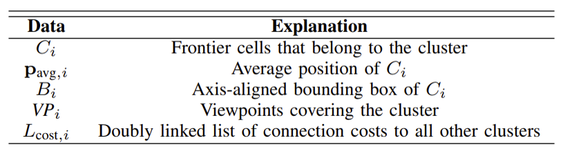
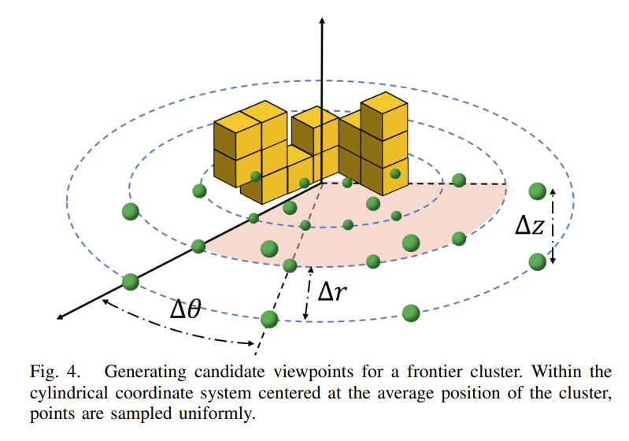
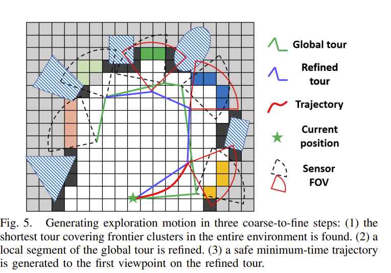
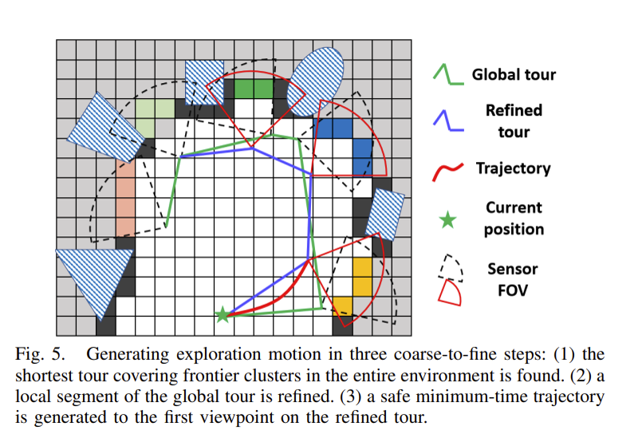
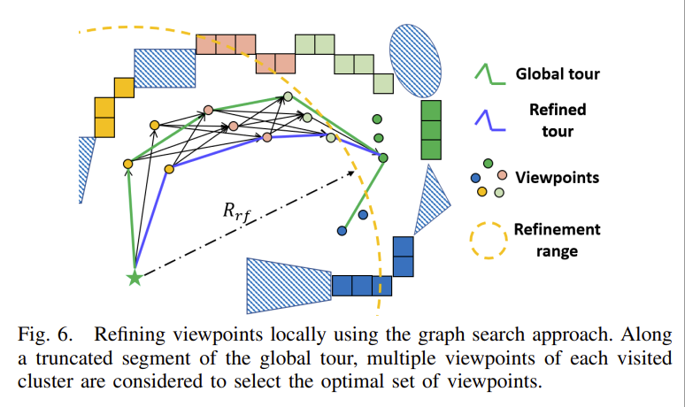

# FUEL: Fast UAV Exploration using Incremental Frontier Structure and Hierarchical Planning FUEL：利用增量前沿结构和分层规划进行快速无人机探索
---
摘要——自主探索是无人机各种应用中的一个基本问题。然而，现有方法显示出探索速率不足，这是由于缺乏高效的全局覆盖、保守的运动计划和低决策频率所致。在本文中，我们提出了一种名为 FUEL 的分层框架，可以在复杂未知环境中支持快速无人机探索。我们通过前沿信息结构（  frontier information structure FIS）在整个探索规划所需的空间中保持关键信息，当空间被探索时，该结构可以被增量更新。在 FIS 的支持下，分层规划器通过三个步骤规划探索运动，这些步骤包括找到高效的全局覆盖路径、细化局部视点集合以及按顺序生成最小时间轨迹。我们进行了广泛的基准测试和实际测试，在这些测试中，我们的方法相比于最先进的方法完成了探索任务，效率前所未有（快3-8倍）。
我们的方法将开源，以造福社区。

关键词——航空系统：应用；航空系统：感知与自主性；运动与路径规划

---

## I. 引言 
 无人机，特别是四旋翼飞行器，在各种应用中都广受欢迎，例如检查、精密农业和搜索与救援。在这些任务中，自主探索是一个基本组成部分，其中飞行器探索和绘制未知环境以收集信息。近年来，已经提出了各种探索规划方法，并展示了一些实际世界的实验。然而，大多数方法都表现出较低/中等的探索速率，这对于许多大规模实际应用来说是不令人满意的。首先，许多现有的规划器以贪婪的方式规划探索运动，例如最大化即时信息增益或导航到最近的未知区域。贪婪策略忽视了全局最优性，因此导致总体效率低下。此外，大多数方法在以前未知的环境中生成相当保守的运动，以同时保证信息增益和安全性。低速探索然而，这种做法限制了四旋翼飞行器充分利用其动态能力来完成任务。最后但同样重要的是，许多方法存在高计算开销，无法对环境变化做出快速而频繁的响应。然而，为了实现更快的探索，当环境的新信息可用时，立即重新规划新的运动是可取的。

受以上事实的启发，本文提出了一种名为 FUEL 的分层框架，可以支持在复杂环境中进行快速无人机探索。我们引入了一个称为前沿信息结构（FIS）的结构，其中包含了探索规划所需的整个空间中的基本信息。当收集到新信息时，该结构可以高效且增量地更新，因此能够支持高频率的规划。基于 FIS，分层规划器通过三个粗到细的步骤生成探索运动。它首先找到一个全局探索路径，该路径在累积的环境信息上是最优的。然后，对路径上的局部视点进行细化，进一步提高了探索速率。最后，生成一个安全、动态可行且最短时间的轨迹。规划器不仅生成了高效的全局覆盖路径，还生成了安全而灵活的局部机动。此外，规划器在探索到未访问区域时会被触发，以便四旋翼飞行器始终能够迅速响应任何环境变化，从而实现持续快速的探索。

我们在模拟中将我们的方法与经典方法和最先进的方法进行了比较。结果显示，在所有情况下，我们的方法都能以更短的时间完成完整的探索（快3-8倍）。此外，我们在各种具有挑战性的实际环境中进行了全载荷实时探索。无论是模拟还是实际测试，都显示出我们的方法相比最先进的方法具有前所未有的性能。为了造福社区，我们将公开源代码。本文的贡献总结如下：
1) 一个增量更新的 FIS，它捕获了整个探索空间的基本信息，并支持高频率的探索规划。
2) 一种分层规划方法，它为高速探索生成了高效的全局覆盖路径和安全灵活的局部机动。
3) 大量的模拟和实际测试验证了所提出的方法。我们系统的源代码将公开。

## II. 相关工作
### A. 探索路径规划
机器人探索，利用移动机器人绘制未知环境，已经研究了多年。一些工作侧重于快速探索空间，就像本文所做的那样。与此同时，其他方法更加注重精确重建。在各种提出的方法中，基于前沿的方法是一种经典方法。这些方法首先在文献[7]中介绍，随后在文献[8]中进行了更全面的评估。为了在3D空间中检测前沿，文献[9]提出了一种基于随机微分方程的方法。在原始方法[7]中，选择最近的前沿作为下一个目标。文献[1]提出了一种不同的方案。在每个决策中，它选择FOV内使速度变化最小以保持一致高飞行速度的前沿。这种方案表现出优于经典方法[7]的效果。在文献[10]中，引入了一种基于前沿信息增益的可微测量方法，允许使用梯度信息优化路径。作为另一种主要方法的采样式探索，随机生成视点来探索空间。这些方法与下一个最佳视角（NBV）的概念密切相关，它重复计算覆盖视角以获得场景的完整模型。文献[12]首次将NBV用于3D探索，在其中使用可访问空间扩展了RRTs，并以递归地方式执行具有最高信息增益的边缘。稍后，该方法被扩展以考虑定位的不确定性[13]、不同对象的视觉重要性[14]和检查任务[15]。为了避免直接丢弃扩展树，文献[16, 17]构建了路网以重用先前的知识。文献[2]使用受RRT*启发的重连方案持续维护和完善单一树。为了实现更快的飞行，文献[5]直接对安全且动态可行的运动原语进行采样，并执行最具信息的运动。
还有一些方法结合了基于前沿和基于采样的方法的优势。文献[4, 18]规划通向前沿的全局路径，并在本地进行路径采样。文献[18]还提出了一种基于梯度的方法来优化本地路径。文献[3]在前沿周围采样视点，并找到通过它们的全局最短路径。文献[6]使用基于采样的算法生成完全覆盖前沿的检查路径。大多数现有方法都贪婪地做出决策，并未考虑四旋翼飞行器的动态特性，导致全局路径不高效和保守的机动。相比之下，我们规划的路径可以高效地覆盖整个环境，并生成动态可行的最短时间轨迹，以实现灵活的飞行。
### B. 四旋翼飞行器轨迹规划
四旋翼飞行器的轨迹规划已经广泛研究，主要可以分为硬约束和软约束两种方法。前者由最小扭矩轨迹首创，后来提出了其闭合形式解决方案。基于最小扭矩轨迹，文献[21]-[23]提取了用于安全轨迹生成的凸安全区域。为了获得更合理的时间分配，提出了快速行进、动力学搜索和混合整数方法。文献[22]还介绍了一种有效的基于Bezier曲线的方法来保证可行性。
软约束方法通常通过制定一个非线性优化来权衡几个目标。近年来，它们被应用于局部重新规划，并展示出了引人注目的性能。这些方法由[31]重新激活，并在[25]后扩展到连续时间轨迹。为了缓解局部最小值问题，文献[26]使用无碰撞路径初始化优化。文献[27]引入均匀B样条进行重新规划。更近期的，文献[28]进一步利用了B样条，并在现场测试中展示了快速飞行。文献[28]在拓扑引导路径和感知感知方面进一步改进。在本文中，我们的轨迹规划基于[28]，但将其扩展到优化B样条的所有参数。通过这种方式，可以最小化总轨迹时间，从而以更高的导航速度探索未知空间。
## III. 系统概述
所提出的框架在一个体素网格地图上运行。如图2所示，它由前沿信息结构的增量更新（第四节）和分层探索规划方法（第五节）组成。每当使用传感器测量更新地图时，都会检查是否有任何前沿聚类受到影响。如果是这样，受影响的聚类的前沿信息结构将被移除，同时提取新的前沿以及它们的前沿信息结构（第四节）。然后，触发探索规划，依次找到全局探索路径，优化局部视点，并生成到选定视点的轨迹（第五节）。如果不存在前沿，则认为探索已完成。

## IV. 增量前沿信息结构
如经典前沿导向探索所述，前沿被定义为紧邻未知体素的已知自由体素，它们被分组成簇来指导导航。传统上，提取的信息过于粗糙，无法进行精细的决策。此外，前沿是通过处理整个地图来检索的，这对于大场景和高规划频率来说是不可扩展的。在这项工作中，我们从前沿中提取更丰富的信息，以实现更精细的规划，并开发了一种增量方法来检测在局部更新的地图中的前沿。

A. 前沿信息结构
当创建新的前沿簇 $( F_i )$ 时，会计算一个前沿信息结构 $( FL_i )$。它存储属于该簇的所有单元格 $( C_i )$ 及其平均位置 $( p_{avg, i} )$。同时还计算了簇的轴对齐包围盒（AABB）$( B_i )$，以加速检测前沿变化（第四节B部分）。为了服务于探索规划（第五节），围绕簇生成候选视点 $( VP_i )$。此外，还计算了一个双向链表 $( L_{cost, i} )$，包含 $( F_i )$ 与所有其他簇之间的连接成本。FIS存储的数据列在表I中。

B. 增量前沿检测和聚类

如图3所示，每当通过传感器测量更新地图时，也会记录更新区域 $(B_m)$ 的轴对齐边界框（AABB），其中移除过时的前沿簇并搜索新的前沿簇。首先，遍历所有簇并仅返回其AABB ($(B_i)$) 与 $(B_m)$ 相交的簇。然后，对返回的簇进行精确检查，移除其中包含不再是前沿的单元的簇。这两个过程受到广/窄阶段碰撞检测算法[32]的启发，这些算法以快速方式消除大多数不受影响的簇，并显著减少昂贵的精确检查的次数。

在移除之后，通过区域生长算法搜索并将新的前沿聚类成组，类似于经典的基于前沿的方法。在这些组中，通常由于噪声传感器观测导致的单元数量较少的组被忽略。然而，剩余的组可能包含大尺寸的簇，这不利于区分未知区域并进行精细决策。因此，我们对每个簇进行主成分分析（PCA），并在第一主轴上将其分割成两个均匀的簇，如果最大特征值超过阈值。分割以递归方式进行，以便所有大簇都被分割成小簇。

C. 视点生成和成本更新

直观上，一个前沿簇意味着一个潜在的目标来探索空间。然而，与之前的方法简单地导航到簇的中心不同，我们需要更精细的决策。为此，当创建一个簇 $(F_i)$ 时，我们生成一组丰富的视点 $(VP_i = \{x_{i,1}, x_{i,2}, \cdots , x_{i,ni}\})$，其中 $(x_{i,j} = (p_{i,j}, \xi_{i,j}))$。视点 $(VP_i)$ 是通过在以簇中心为原点的圆柱坐标系中均匀采样点来找到的，如图4所示。对于位于自由空间内的每个采样点 p，通过使用类似于 [16] 的偏航优化方法确定偏航角度 $(\xi)$，使传感器覆盖簇的最大化。覆盖率被评估为符合传感器模型且不被占用体素遮挡的前沿单元的数量。然后，保留覆盖率高于阈值的视点，并按覆盖率降序排序。我们保留在 $(VP_i)$ 中最多 $(N_{view})$ 个视点 ($(n_i \leq N_{view})$) 以使本地视点细化（见第五部分）具有可操作性。

$$ t_{lb}(x_{k1,j1}, x_{k2,j2}) = \max \left\{ \frac{\text{length} (P(p_{k1,j1}, p_{k2,j2}))}{v_{\max}}, \frac{\min (|\xi_{k1,j1} - \xi_{k2,j2}|, 2\pi - |\xi_{k1,j1} - \xi_{k2,j2}|)}{\xi_{\max}} \right\} $$

其中，$(P(p_{k1,j1}, p_{k2,j2}))$ 表示通过路径搜索算法找到的点 $(p_{k1,j1})$ 和 $(p_{k2,j2})$ 之间的无碰撞路径，$(v_{\max})$ 和 $(\xi_{\max})$ 分别是速度和偏航角速度的上限。对于每对 $(F_{k1}, F_{k2})$，我们选择覆盖率最高的视点并估算成本为 $(t_{lb}(x_{k1,1}, x_{k2,1}))$，其中 $(P(p_{k1,1}, p_{k2,1}))$ 使用A*算法在体素网格图上搜索。

请注意，从头开始计算所有 $(N_{cls})$ 簇对之间的连接成本需要 $(O(N_{cls}^2))$ 次 A* 搜索，这相当昂贵。幸运的是，这些成本也可以通过增量方式计算。当移除过时的簇时（见第四部分B节），所有剩余FIS的关联成本项 $(L_{cost,i})$ 被擦除。之后，从每个新簇到所有其他簇的连接成本会被重新计算。

为了执行探索路径的全局规划（见第五部分），需要每对簇 $(F_{k1}, F_{k2})$ 之间的连接成本。设 $(t_{lb}(x_{k1,j1}, x_{k2,j2}))$ 表示在两个视点 $(x_{k1,j1})$ 和 $(x_{k2,j2})$ 之间移动时的时间下限成本，它由以下公式计算：
$$ t_{lb}(x_{k1,j1}, x_{k2,j2}) = \max \left\{ \frac{\text{length} (P(p_{k1,j1}, p_{k2,j2}))}{v_{\max}}, \frac{\min (|\xi_{k1,j1} - \xi_{k2,j2}|, 2\pi - |\xi_{k1,j1} - \xi_{k2,j2}|)}{\xi_{\max}} \right\} $$

其中，$(P(p_{k1,j1}, p_{k2,j2}))$ 表示通过路径搜索算法找到的点 $(p_{k1,j1})$ 和 $(p_{k2,j2})$ 之间的无碰撞路径，$(v_{\max})$ 和 $(\xi_{\max})$ 分别是速度和偏航角速度的上限。对于每对 $(F_{k1}, F_{k2})$，我们选择覆盖率最高的视点并估算成本为 $(t_{lb}(x_{k1,1}, x_{k2,1}))$，其中 $(P(p_{k1,1}, p_{k2,1}))$ 使用A*算法在体素网格图上搜索。

请注意，从头开始计算所有 $(N_{cls})$ 簇对之间的连接成本需要 $(O(N_{cls}^2))$ 次 A* 搜索，这相当昂贵。幸运的是，这些成本也可以通过增量方式计算。当移除过时的簇时（见第四部分B节），所有剩余FIS的关联成本项 $(L_{cost,i})$ 被擦除。之后，从每个新簇到所有其他簇的连接成本会被重新计算。
$$ t_{lb}(x_{k1,j1}, x_{k2,j2}) = \max \left\{ \frac{\text{length} (P(p_{k1,j1}, p_{k2,j2}))}{v_{\max}}, \frac{\min (|\xi_{k1,j1} - \xi_{k2,j2}|, 2\pi - |\xi_{k1,j1} - \xi_{k2,j2}|)}{\xi_{\max}} \right\} $$

其中，$(P(p_{k1,j1}, p_{k2,j2}))$ 表示通过路径搜索算法找到的点 $(p_{k1,j1})$ 和 $(p_{k2,j2})$ 之间的无碰撞路径，$(v_{\max})$ 和 $(\xi_{\max})$ 分别是速度和偏航角速度的上限。对于每对 $(F_{k1}, F_{k2})$，我们选择覆盖率最高的视点并估算成本为 $(t_{lb}(x_{k1,1}, x_{k2,1}))$，其中 $(P(p_{k1,1}, p_{k2,1}))$ 使用A*算法在体素网格图上搜索。

请注意，从头开始计算所有 $(N_{cls})$ 簇对之间的连接成本需要 $(O(N_{cls}^2))$ 次 A* 搜索，这相当昂贵。幸运的是，这些成本也可以通过增量方式计算。当移除过时的簇时（见第四部分B节），所有剩余FIS的关联成本项 $(L_{cost,i})$ 被擦除。之后，从每个新簇到所有其他簇的连接成本会被重新计算。

## V. 分层探索规划

我们并未采用贪心探索策略或生成保守的机动动作，而是生成覆盖前沿的全局路径，并规划安全而灵活的动作以实现更快的飞行。我们的规划器借鉴了最新的分层四旋翼规划范式[21, 22, 28]，并在三个阶段做出决策，如图5所示。

A. 全局探索巡航规划

我们的探索规划始于寻找一条全局巡航路线，以高效地覆盖现有的前沿簇。受[3]的启发，我们将其表述为旅行商问题（TSP）的变体，它计算从当前视点开始经过所有簇的视点的开放环路线。我们将这个变体简化为标准的不对称TSP（ATSP），通过合理设计相关成本矩阵 $(M_{tsp})$ 来快速解决这一问题。

假设共有 $(N_{cls})$ 个簇，$(M_{tsp})$ 对应于一个 $(N_{cls} + 1)$ 维的方阵。主要部分是由每对前沿簇之间的连接成本组成的 $(N_{cls} \times N_{cls})$ 矩阵块，其计算如下：

$$ M_{tsp}(k_1, k_2) = M_{tsp}(k_2, k_1) = t_{lb}(x_{k1,1}, x_{k2,1}), \quad k_1, k_2 \in \{1, 2, \cdots, N_{cls}\} $$

如第四部分C节所述，当检测到前沿时，这些信息会被维护。因此，$(N_{cls} \times N_{cls})$ 矩阵块可以在没有额外开销的情况下填充。

$( M_{tsp} )$ 的第一行和第一列与当前视点 $( x_0 = (p_0, \xi_0) )$ 和 $( N_{cls} )$ 个簇相关。从 $( x_0 )$ 开始，到第 $( k )$ 个簇的成本评估如下：

$$ M_{tsp}(0, k) = t_{lb}(x_0, x_{k,1}) + w_c \cdot c_c(x_{k,1}), \quad k \in \{1, 2, \cdots , N_{cls}\} $$

这里引入了运动一致性成本 $( c_c(x_{k,1}) )$，一般计算如下：

$$ c_c(x_{k,j}) = \cos^{-1} \left( \frac{(p_{k,j} - p_0) \cdot v_0}{\|p_{k,j} - p_0\| \|v_0\|} \right) $$

其中，$( v_0 )$ 是当前速度。在某些情况下，多个巡航路径具有相似的时间下限，因此在连续的规划步骤中可能会生成来回的机动动作，从而减缓进度。我们通过 $( c_c(x_{k,1}) )$ 来消除这种不一致性，该成本惩罚飞行方向的大变化。

我们的问题不同于标准的TSP，其解决方案是一个闭环巡航路径。然而，我们可以通过将其他簇到当前视点的连接成本设为零，将其简化为一个ATSP：
$$ M_{tsp}(k, 0) = 0, \quad k \in \{0, 1, 2, \cdots, N_{cls}\} $$

通过这种方式，返回到当前视点在任何闭环巡航路径中不会产生额外的成本，因此每个闭环巡航路径总是包含一个具有相同成本的开放环路径。结果，我们可以通过找到最佳闭环路径并检索其等成本的开放环路径，获得最佳的开放环路径。

B. 局部视点细化

全局巡航规划找到了一个有希望的顺序来访问所有簇。然而，它仅涉及每个簇的一个视点，这不一定是所有视点中的最佳组合。为此，考虑在全局巡航路径的一个截断段上使用更丰富的视点集合，以进一步提高探索率，采用图搜索方法，如图6所示。我们发现全局巡航路径上的连续簇的视点比当前位置更接近 $(R_{rf})$。为了简化符号，假设 $(F_i, 1 \leq i \leq N_{rf})$ 是考虑的簇。我们为它们的视点 $(VP_i)$ 和当前视点 $(x_0)$ 创建图节点。然后每个节点连接到与下一个簇相关的其他节点，形成一个有向无环图，捕捉截断巡航路径的可能变化。我们利用Dijkstra算法搜索最优的局部巡航路径 $(\Xi = \{x_{1,j1}, x_{2,j2}, \cdots , x_{N_{rf},jN_{rf}}\})$，以最小化成本：

$$ c_{rf}(\Xi) = t_{lb}(\mathbf{x}_0, \mathbf{x}_{1,j_1}) + w_c \cdot c_c(\mathbf{x}_{1,j_1}) + t_{lb}(\mathbf{x}_{N_{rf},j_{N_{rf}}}, \mathbf{x}_{N_{rf}+1,1}) + \sum_{k=1}^{N_{rf}-1} t_{lb}(\mathbf{x}_k, \mathbf{x}_{j_k}, \mathbf{x}_{k+1, j_{k+1}}) $$

这也包括了时间下界和运动一致性。请注意，将信息增益 [4, 12] 纳入公式 (6) 是很直接的，但是评估多个视角的信息增益是昂贵的。从实践来看，我们发现仅基于覆盖率采用视角要快得多，并且始终能得到满意的结果。

### 最小时间B样条轨迹

鉴于离散的视点，为了实现平滑的导航，需要连续的轨迹。我们的四旋翼轨迹规划基于一种方法[28]，该方法生成平滑、安全且动态可行的B样条轨迹。我们进一步优化B样条的所有参数，以便最小化总轨迹时间，使四旋翼飞行器能够充分利用其动态能力。

由于四旋翼飞行器的动态特性是微分平坦的[19]，我们为平坦输出 \( \mathbf{x} \in (x, y, z, \xi) \) 规划轨迹。设 \( \mathbf{X}_{cb} = \{\mathbf{x}_{c,0}, \mathbf{x}_{c,1}, \cdots, \mathbf{x}_{c,N_b}\} \)，其中 \( \mathbf{x}_{c,i} = (\mathbf{p}_{c,i}, \xi_{c,i}) \) 是一个 \( p_b \) 次均匀B样条的 \( N_b + 1 \) 控制点， \( \Delta t_b \) 是节点间隔。我们找到在平滑性和总轨迹时间之间权衡的B样条，并满足安全性、动态可行性和边界状态约束。它可以表示为如下的优化问题：

\[
\arg \min_{\mathbf{x}_{c,b}, \Delta t_b} f_s + w_t T + \lambda_c f_c + \lambda_d (f_v + f_a) + \lambda_{bs} f_{bs}
\]

类似于[28]， \( f_s \) 是弹性带平滑成本：

\[
f_s = \sum_{i=0}^{N_b-2} \mathbf{s}_i^T \mathbf{R}_s \mathbf{s}_i，\ \mathbf{s}_i = \mathbf{x}_{c,i+2} - 2\mathbf{x}_{c,i+1} + \mathbf{x}_{c,i}
\]

其中， \( \mathbf{R}_s \) 是惩罚矩阵：

\[
\mathbf{R}_s = \begin{bmatrix}
w_{s,p} \mathbf{I}_3 & 0 \\
0^T & w_{s,\xi}
\end{bmatrix}
\]

## 系统结构图

这个框图分为两个主要部分：增量前沿信息结构（Incremental Frontier Information Structure）和分层规划（Hierarchical Planning），分别用红色虚线和绿色虚线框住。

### 增量前沿信息结构
这部分负责检测和更新前沿信息，主要步骤如下：

1. **Frontier Changed?（前沿改变？）**：
   - 检查当前前沿是否发生变化。如果发生变化，则进行下一步。

2. **Frontier Detection and Clustering（前沿检测和聚类）**：
   - 进行前沿检测并将其聚类，识别出新的前沿区域。

3. **Viewpoint Generation（视点生成）**：
   - 基于检测到的前沿，生成新的视点（观测点）。

4. **Connection Cost Update（连接成本更新）**：
   - 更新连接成本，以反映新的前沿信息和视点。

### 分层规划
这部分负责从视点到实际路径的规划，主要步骤如下：

1. **Volumetric Mapping（体积映射）**：
   - 使用网格地图（Grid Map）进行体积映射，生成ESDF（Euclidean Signed Distance Field，欧几里得符号距离场）。

2. **Global Tour Planning（全局旅行规划）**：
   - 基于生成的视点和ESDF，进行全局路径规划。

3. **Local Viewpoint Refinement（局部视点优化）**：
   - 优化局部视点，确保路径的局部细节。

4. **Minimum-time B-spline Trajectory（最小时间B样条轨迹）**：
   - 生成最小时间的B样条轨迹，确保路径的效率和光滑性。

5. **Controller（控制器）**：
   - 最终由控制器使用生成的轨迹进行实际的路径跟踪。

整个流程的输入包括网格地图（Grid Map）和ESDF，用于生成路径；输出是轨迹（Trajectory），由控制器进行跟踪。

### 数据流
- 从网格地图到前沿检测，再到视点生成和连接成本更新，这些信息会被传递到分层规划部分。
- 在分层规划部分，信息从全局旅行规划到局部视点优化，再到最小时间B样条轨迹，最后到控制器。

这两个部分共同作用，确保前沿信息的实时更新和路径的高效规划。

这个图表示了机器人在环境中生成探索运动的三步粗细粒度方法。让我们详细解释图中的各个部分和过程：

### 组成部分：
1. **网格地图**：背景是表示环境的网格地图。
2. **全局路径（绿色线）**：这是覆盖整个环境中所有前沿集群（需要探索的区域）的初始路径。
3. **精细路径（蓝色线）**：这是全局路径的一部分，经过进一步优化后得到的路径。
4. **轨迹（红色线）**：这是从当前的位置到达第一个视点的安全最短时间轨迹。
5. **当前位置（绿色星星）**：表示机器人的当前位置。
6. **传感器视野（虚线圆弧和扇形区域）**：表示传感器的视野范围。

### 过程：
1. **全局路径生成**：首先找到覆盖整个环境中所有前沿集群的最短路径。这条路径用绿色线表示。
2. **局部路径优化**：在全局路径中选择一个局部段并进行精细化处理，以得到一条更优化的路径，这条路径用蓝色线表示。
3. **轨迹生成**：生成一条从当前位置到精细路径第一个视点的安全最短时间轨迹，这条轨迹用红色线表示。

图例中说明了每种线条和符号的含义，帮助理解机器人在环境中的探索路径规划过程。

好的，让我们更详细地解释图6。

图6展示了使用图搜索方法局部优化视点的过程。为了更好地理解这个图，让我们逐步解析其各个部分。

1. **全局巡航路径 (Global tour)**：用绿色曲线表示，代表了一个初步规划好的路径，这条路径访问了所有的簇（Clusters）。

2. **优化后的局部巡航路径 (Refined tour)**：用蓝色曲线表示，这条路径是在全局巡航路径的基础上，通过选择最佳视点组合优化后的路径。

3. **视点 (Viewpoints)**：用不同颜色的圆点表示，代表了每个簇中的潜在视点。

4. **优化范围 (Refinement range)**：用黄色虚线圈表示，代表了进行局部优化的范围。在这个范围内，我们考虑多个视点以选择最优组合。

5. **当前视点 (Current viewpoint)**：图中的绿色星星表示，作为优化路径的起点。

6. **距离 \(R_{rf}\)**：表示当前视点与优化范围内视点之间的距离，展示了这些视点与当前位置的相对接近程度。

### 过程解释：

- **全局巡航路径**：最初找到的一条访问所有簇的路径。然而，这条路径只选择了每个簇中的一个视点，并不一定是所有视点中的最佳组合。
  
- **视点优化**：为了提高探索效率，在全局巡航路径的一个截断段（如图中的黄色虚线圈）上，我们考虑更多的视点集合，使用图搜索方法进行优化。
  
- **图搜索方法**：我们创建一个有向无环图 (DAG)，其中每个节点代表一个视点（当前视点 \(x_0\) 和每个簇中的视点 \(VP_i\)）。每个节点连接到与下一个簇相关的其他节点，形成可能路径的图。
  
- **路径优化**：利用Dijkstra算法搜索最优的局部巡航路径 \( (\Xi = \{x_{1,j1}, x_{2,j2}, \cdots , x_{N_{rf},jN_{rf}}\}) \)，使得下述公式中的成本最小化：

\[ c_{rf}(\Xi) = t_{lb}(\mathbf{x}_0, \mathbf{x}_{1,j_1}) + w_c \cdot c_c(\mathbf{x}_{1,j_1}) + t_{lb}(\mathbf{x}_{N_{rf},j_{N_{rf}}}, \mathbf{x}_{N_{rf}+1,1}) + \sum_{k=1}^{N_{rf}-1} t_{lb}(\mathbf{x}_k, \mathbf{x}_{j_k}, \mathbf{x}_{k+1, j_{k+1}}) \]

- **优化结果**：通过这种方法，我们获得了一条更优化的局部巡航路径（蓝色曲线），能够提高探索效率并减少计算成本。

总的来说，图6展示了如何在全局巡航路径的基础上，通过图搜索方法进行局部优化，从而选择最佳的视点组合，以达到更高的探索效率和更低的计算成本。

公式 (6) 详细解释如下：

\[ c_{rf}(\Xi) = t_{lb}(\mathbf{x}_0, \mathbf{x}_{1,j_1}) + w_c \cdot c_c(\mathbf{x}_{1,j_1}) + t_{lb}(\mathbf{x}_{N_{rf},j_{N_{rf}}}, \mathbf{x}_{N_{rf}+1,1}) + \sum_{k=1}^{N_{rf}-1} t_{lb}(\mathbf{x}_k, \mathbf{x}_{j_k}, \mathbf{x}_{k+1, j_{k+1}}) \]

这个公式表示的是一个路径 \( \Xi \) 的总成本，其中包括了从起点到终点的一系列点间的时间下界和一致性成本。具体来说，这个公式的各个部分如下：

1. **\( t_{lb}(\mathbf{x}_0, \mathbf{x}_{1,j_1}) \)**：
   - 表示从起点 \( \mathbf{x}_0 \) 到第一个视点 \( \mathbf{x}_{1,j_1} \) 的时间下界 (lower bound)。
   - 这是路径的起始部分，计算从起点到第一个簇中的视点的成本。

2. **\( w_c \cdot c_c(\mathbf{x}_{1,j_1}) \)**：
   - \( w_c \) 是一个权重系数，用于平衡路径中的不同成本。
   - \( c_c(\mathbf{x}_{1,j_1}) \) 是第一个视点 \( \mathbf{x}_{1,j_1} \) 的一致性成本 (consistency cost)。
   - 这一部分表示路径选择中视点的一致性代价，确保选择的视点在路径上是合理和一致的。

3. **\( t_{lb}(\mathbf{x}_{N_{rf},j_{N_{rf}}}, \mathbf{x}_{N_{rf}+1,1}) \)**：
   - 表示从最后一个簇的最后一个视点 \( \mathbf{x}_{N_{rf},j_{N_{rf}}} \) 到路径终点 \( \mathbf{x}_{N_{rf}+1,1} \) 的时间下界。
   - 这是路径的结束部分，计算从最后一个簇中的视点到终点的成本。

4. **\( \sum_{k=1}^{N_{rf}-1} t_{lb}(\mathbf{x}_k, \mathbf{x}_{j_k}, \mathbf{x}_{k+1, j_{k+1}}) \)**：
   - 这是一个求和项，表示从第一个簇到最后一个簇之间每一对相邻簇中视点之间的时间下界的总和。
   - \( k \) 是簇的索引，表示从第 \( k \) 个簇到第 \( k+1 \) 个簇之间的路径。
   - \( \mathbf{x}_k \) 和 \( \mathbf{x}_{j_k} \) 表示第 \( k \) 个簇中的视点，\( \mathbf{x}_{k+1} \) 和 \( \mathbf{x}_{j_{k+1}} \) 表示第 \( k+1 \) 个簇中的视点。
   - 这一部分计算的是从一个簇到下一个簇的各个视点之间的时间成本。

### 总结

公式 (6) 描述的是从起点到终点通过若干簇的视点的总成本，包括时间下界和一致性成本。具体而言，这个公式考虑了：

- 从起点到第一个簇的时间成本和一致性成本。
- 从第一个簇到最后一个簇之间每一对相邻簇中视点之间的时间成本。
- 从最后一个簇到终点的时间成本。

通过这些成本的总和，公式 (6) 旨在找到一条优化的路径，使得总成本最小化，从而提高路径选择的效率和一致性。